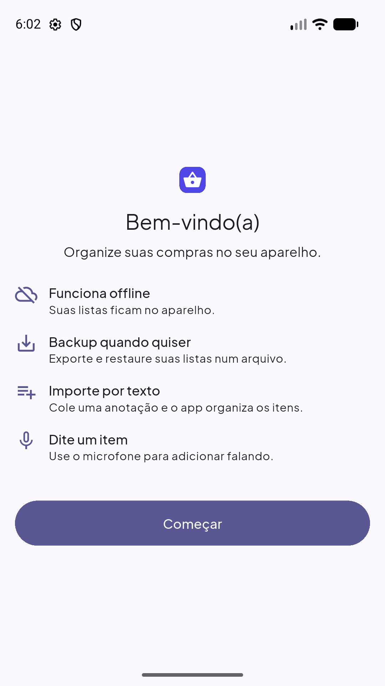
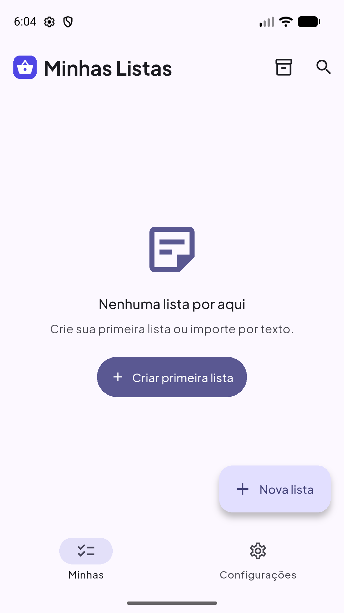
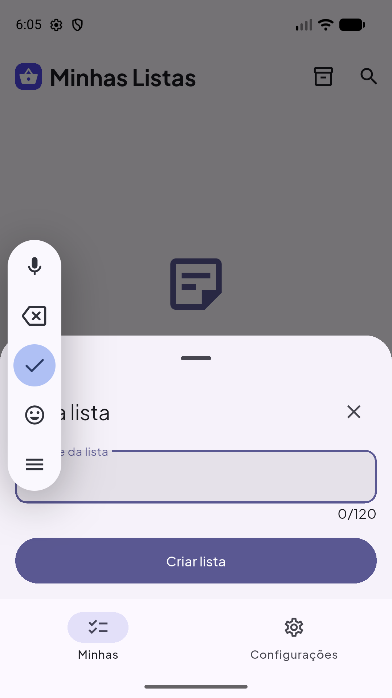
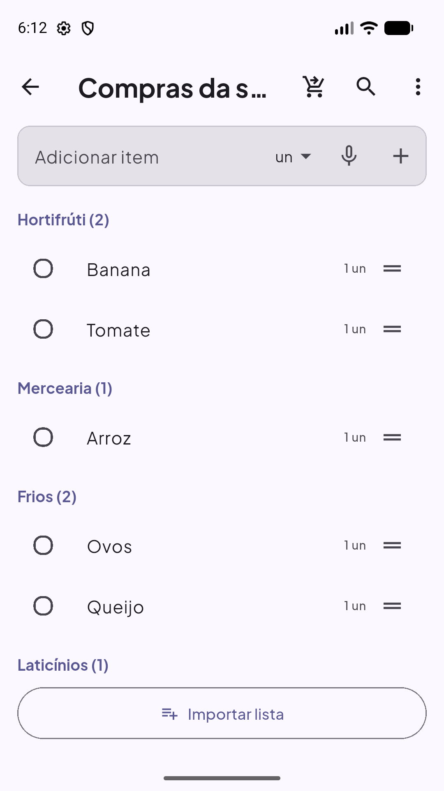
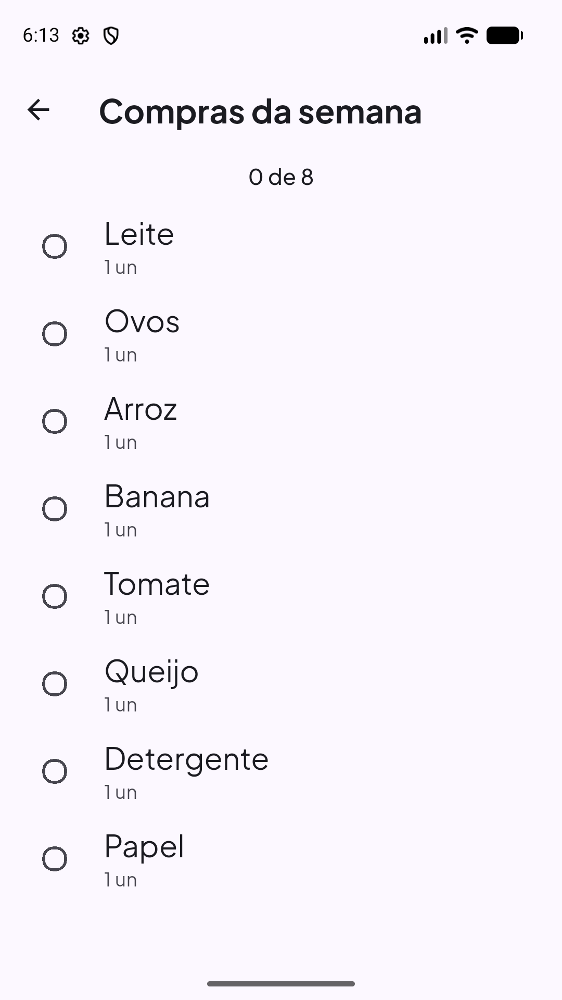
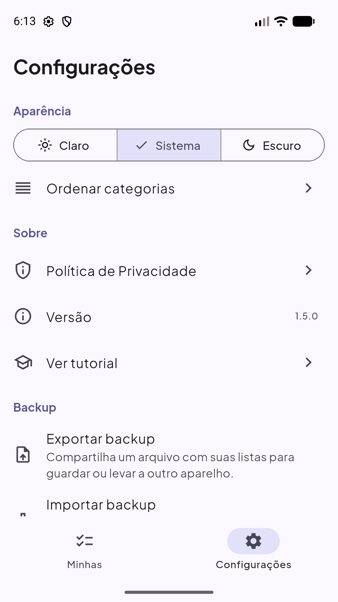

<p align="center">
  
</p>

<h1 align="center">Minhas Listas</h1>

<p align="center">
  Aplicativo de lista de compras <strong>local e offline-first</strong> — 100% no aparelho, sem conta e sem nuvem.
</p>

<p align="center">
  <a href="https://github.com/oliverlucasfer/listacompras/actions/workflows/ci.yml"></a>
  
  
  
</p>

---

## Sobre

**Minhas Listas** é um app de lista de compras **100% local**: os dados vivem no aparelho (Drift/SQLite é a
fonte da verdade) e nada depende de rede, conta ou sincronização. O produto final é um **app único**
(RF-31 / ADR-015) — Android, iOS, Web (uso local, ADR-013) e Desktop (Windows/Linux/macOS, ADR-012).

- **Offline-first:** criar, marcar e finalizar compras sem conexão; os dados persistem ao fechar/reabrir.
- **Privacidade (LGPD):** nenhum dado sai do aparelho — sem conta, sem analytics, sem anúncios (RNF-05).
- **Backup local:** exportar/importar um `.json` fiel ao banco (listas, itens, histórico de preços e idas de compra com seus itens e o mercado).

## Recursos

- **Listas e itens:** criar, renomear, arquivar e excluir listas; CRUD de itens com quantidade (inclusive
  frações como `½` e `1 1/2`), unidade (enum fechado) e checkbox; reordenar por drag-and-drop; ações em massa.
- **Organização por categoria:** 11 categorias com sugestão local em camadas (memória por nome → dicionário
  estático → `outros`) e ordem de categorias personalizável.
- **Importação por texto:** colar uma anotação em texto livre e obter itens estruturados (parser local
  determinístico) com pré-visualização editável (RF-16).
- **Escrever por voz:** adicionar itens falando em pt-BR, com reconhecimento on-device (RF-26).
- **Modo mercado:** tela focada no corredor — pendentes em destaque, contador e faixa de marcados (RF-18).
- **Preço, total e orçamento:** preço unitário opcional por item, total ao vivo "no carrinho" e orçamento
  por lista comparado ao total (RF-21, RF-28).
- **Histórico e estatísticas:** "Finalizar compra" grava uma ida (snapshot); aba Histórico com idas e
  estatísticas (gasto por período/categoria, itens mais comprados, evolução de preço) (RF-34).
- **Preço por mercado:** registrar o mercado ao finalizar e comparar preços (último + mais barato) entre idas
  e mercados (RF-35).
- **Compartilhar sem nuvem:** enviar/receber uma lista por texto, arquivo `.json` ou QR/código, sempre
  criando uma lista nova (RF-33).
- **Onboarding:** boas-vindas, estados vazios explicativos e tour guiado reabrível (RF-27).
- **Tema:** Material 3 Expressive, claro/escuro/sistema, com acessibilidade (alvos ≥ 48dp, contraste AA).

## Screenshots

| Boas-vindas | Minhas Listas (vazio) | Nova lista |
| :---: | :---: | :---: |
|  |  |  |
| Lista por categoria | Modo mercado | Configurações e backup |
|  |  |  |

## Stack & arquitetura

| Camada | Tecnologia | Papel |
| :--- | :--- | :--- |
| App | **Flutter (Dart)** + **Riverpod** + **go_router** | UI reativa multiplataforma; sem rede |
| Persistência | **Drift / SQLite** | Fonte de verdade local; leitura via Streams; migrações versionadas |
| Ops | **GitHub Actions** | CI obrigatório (format, analyze, test, builds) |

```
UI (Flutter + Riverpod)
        │
        ▼
Drift / SQLite  ──  fonte da verdade local (offline-first)
        ▲
        └── parser local determinístico · backup JSON · histórico de preços
```

Não há backend, conta, sincronização, colaboração ou push (ADR-015). IDs são UUID v4 gerados no cliente
(ADR-006); unidades e categorias são enums fechados (ADR-005/ADR-011).

## Estrutura do projeto

```
lib/
  core/       # tema e design system (widgets App*), domínio (unidade/categoria),
              # parser local de importação, l10n, navegação, utilidades
  drift/      # banco local: tabelas, conexões (nativa/web por import condicional), migrações
  features/   # listas, histórico, compartilhamento, backup, importação,
              # configurações, onboarding, tour, voz, OCR, etiqueta,
              # notificações, widget e vitrine do design system
  main.dart · app.dart · router.dart
test/         # testes: repositórios/Drift, parser local e fluxos críticos
docs/         # documentação (um doc dono por tema; índice em planejamento_lista_compras.md)
store/        # ficha e artefatos da Google Play (ícone, feature graphic, screenshots)
site/         # política de privacidade pública
```

## Começando

### Pré-requisitos

- **Flutter 3.44.5** (stable) — Dart `^3.12.2` incluso. Rode `flutter doctor` e resolva as pendências do(s)
  alvo(s) que for usar (Android/iOS/Web/Desktop).
- **Android:** Android Studio + SDK e emulador (`adb`).
- **Desktop (opcional):** toolchain nativo — Visual Studio (Windows) ou `clang`/`cmake`/`ninja`/GTK (Linux).

### Rodar

```bash
git clone https://github.com/oliverlucasfer/listacompras.git
cd listacompras
flutter pub get
flutter run            # escolha o device, ex.: -d chrome, -d windows, -d macos
```

### Builds

O app é **único** ("Minhas Listas", `br.com.oliverlucas.listacompras.lite`), **sem flavors** e
**sem `--dart-define`**:

```bash
flutter build apk --release
flutter build appbundle --release      # AAB para a Play
flutter build web --release
flutter build linux                    # ou: flutter build windows / flutter build macos
```

## Qualidade & CI

```bash
flutter test                          # testes
dart format . && flutter analyze      # estilo e lint (o CI exige)
```

O pipeline (`.github/workflows/ci.yml`, disparado em PR e push em `main`) roda:

- **`flutter`:** `dart format --set-exit-if-changed`, `flutter analyze`, `flutter test`, build Web, apk
  debug e **AAB release**; em seguida **verifica o manifest release** — falha se vazar `INTERNET`/`c2dm` ou
  o **SDK do Firebase** (messaging/iid/installations/datatransport e afins) e confirma `allowBackup="false"`
  e `RECORD_AUDIO` (voz). Detalhes em [`docs/07`](docs/07-qualidade-ci.md) §3.
- **`desktop`:** matriz Linux (`flutter build linux`) e Windows (`flutter build windows`), com `fail-fast: false`.

Estratégia de testes, cobertura e observabilidade: [`docs/07`](docs/07-qualidade-ci.md).

## Privacidade & LGPD

- **Nada sai do aparelho** — sem conta, sem backend, sem telemetria, sem anúncios (RNF-05).
- O único dado sensível tratado é o **áudio** do recurso de voz, processado pelo reconhecedor do sistema.
- **Política de privacidade pública:** <https://oliverlucasfer.github.io/listacompras/privacidade.html>
  (fonte em [`site/privacidade.html`](site/privacidade.html)).
- Contato: **oliverlucasfer@gmail.com**.

## Documentação

A documentação é **spec-driven** e cada tema tem um doc dono. Índice completo em
[`planejamento_lista_compras.md`](planejamento_lista_compras.md) e contexto técnico em uma leitura em
[`docs/13-premodelo-tecnico.md`](docs/13-premodelo-tecnico.md).

| # | Documento | Conteúdo |
| :--- | :--- | :--- |
| [00](docs/00-visao-geral.md) | Visão Geral | Produto, stack, setup, riscos, ADRs e cronograma |
| [04](docs/04-importacao-lista.md) | Importação | Parser local (RF-16), limites e enums |
| [05](docs/05-app-flutter.md) | App Flutter | Arquitetura, providers, rotas, telas e UX |
| [06](docs/06-mvp-entregas.md) | MVP & Entregas | Critérios de aceite, LGPD e publicação |
| [07](docs/07-qualidade-ci.md) | Qualidade & CI | Estratégia de testes e GitHub Actions |
| [09](docs/09-runbook-operacoes.md) | Runbook de Operações | Builds, distribuição e publicação |
| [10](docs/10-wireframes-telas.md) | Wireframes | Layout de todas as telas |
| [11](docs/11-usabilidade-fase5.md) | Usabilidade | Roteiro e critérios de teste |
| [12](docs/12-prd.md) | PRD | Requisitos (RF/RNF) com IDs e rastreabilidade |
| [13](docs/13-premodelo-tecnico.md) | Pré-modelo Técnico | Contexto condensado (ler primeiro) |
| [14](docs/14-tarefas.md) | Tarefas | Breakdown executável por fase + progresso |
| [15](docs/15-design-system.md) | Design System | Tokens, componentes e acessibilidade |
| [16](docs/16-roadmap-pos-mvp.md) | Roadmap Pós-MVP | Backlog de frentes futuras |

Instruções para agentes/implementadores: [`AGENTS.md`](AGENTS.md).

## Roadmap

O backlog de frentes futuras (ainda sem spec) e a ordem combinada vivem em
[`docs/16-roadmap-pos-mvp.md`](docs/16-roadmap-pos-mvp.md). Fases concluídas e critérios de pronto:
[`docs/14-tarefas.md`](docs/14-tarefas.md).
